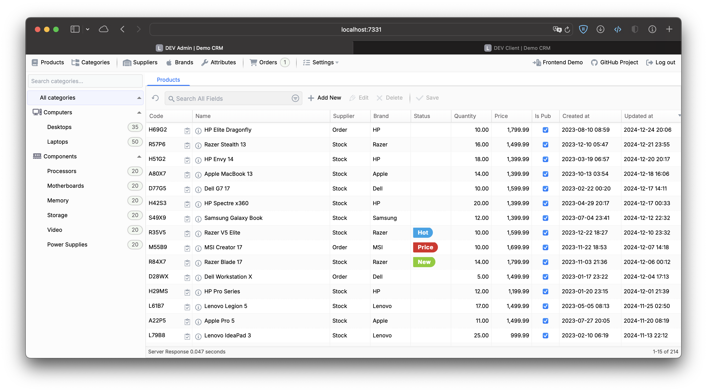
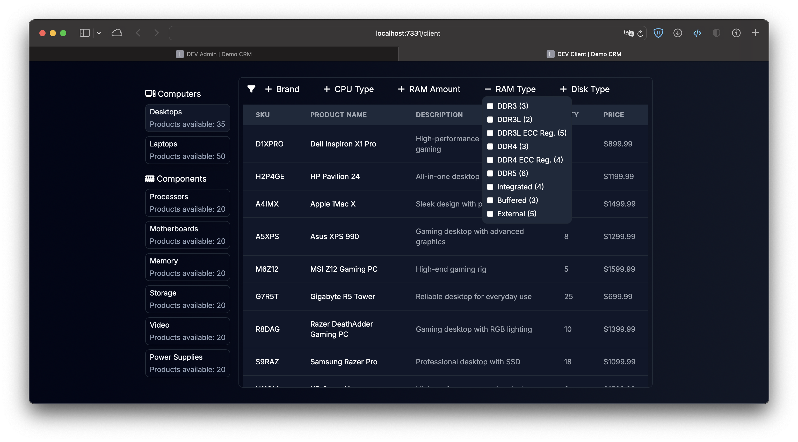

# gostart-crm

## Overview

A powerful and simple e-commerce web application starter project.
This open-source version includes core features such as:

- **Admin dashboard**: Manage the platform through a rich user interface
- **Client view**: Browse and filter products as a customer
- **Product management**: Add, update, and manage product listings
- **Orders management**: Track and process customer orders

## Stack

- **Backend**: Go with Echo, templ, sqlx;
- **Frontend**: tailwind, htmx, alpine, w2ui (admin dashboard);

## Live Demo

- **Live read-only demo**: https://democrm.weasel.dev

## Structure

- **cmd/server**: Main application entry point
- **internal/pkg**: Bootstrapper package for initializing the app
- **internal/app/model**: Contains shared data transfer objects (DTOs) and types
- **internal/app/component**: HTML templates (.templ files) user for rendering views
- **internal/app/endpoint**: Router and HTTP handlers
- **internal/app/service**: Business logic and service layer
- **internal/app/storage**: Database access layer
- **migrations**: SQL migration scripts (Goose for versioning)
- **web**: Static assets such as JS bundles, CSS, and fonts

## Prerequisites

Make sure you have the following installed to run the project:

- **Go >= 1.23**: Backend server
- **Bun >= 1.1**: Build system for bundling assets

## Build

Follow these steps to build and run the project:

```sh
cp .env.example .env  # prepare the '.env' with default settings
bun install           # install node dependencies
bun install:tools     # install necessary go tools into the 'build' folder
bun run build         # build the js, css, static, fonts, templ and go server
./build/server        # start the server
bun watch             # start the server in watch mode (live reload)
```

After starting the server, the application will be available at:

- `http://localhost:1323` (normal mode)
- `http://localhost:7331` (watch mode)

## Screenshots

- **Admin Panel**: The admin dashboard, showcasing product and order management.
  

- **Client View**: The front-end interface for customers to browse products.
  
